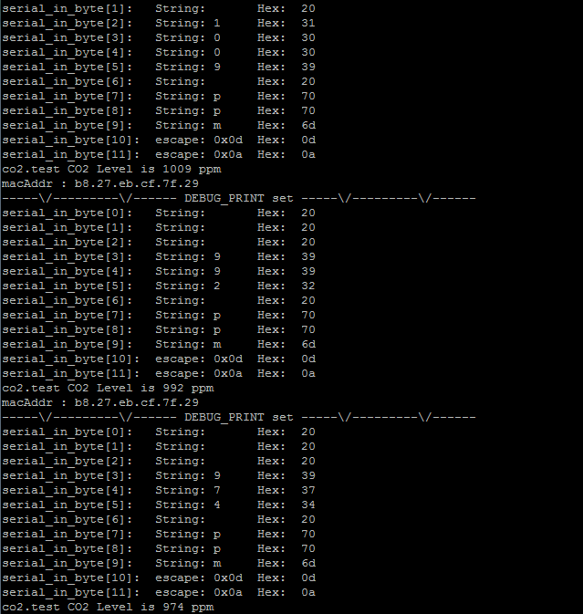

# CO2 센서

|CO2|CO2 function|
|----|----||
|1|3.3V||
|2|5V|V|
|3|SDA||
|4|5V|V|
|5|SCL||
|6|GND|V|
|7|#4||
|8|#14/TXD|V|
|9|GND||
|10|#15RXD|V|
|11|#17||
|12|#18||
|13|#27||
|14|GND|V|
|15|#27|V|
|16|#23|V|
